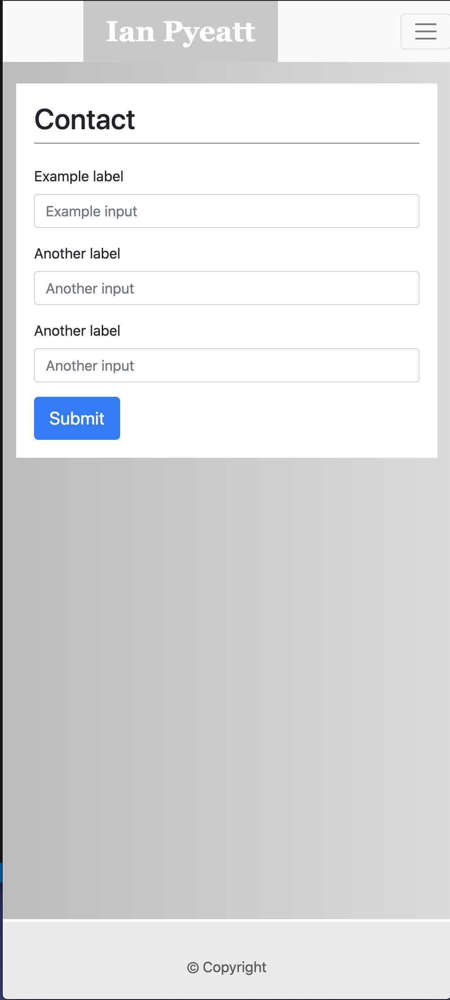
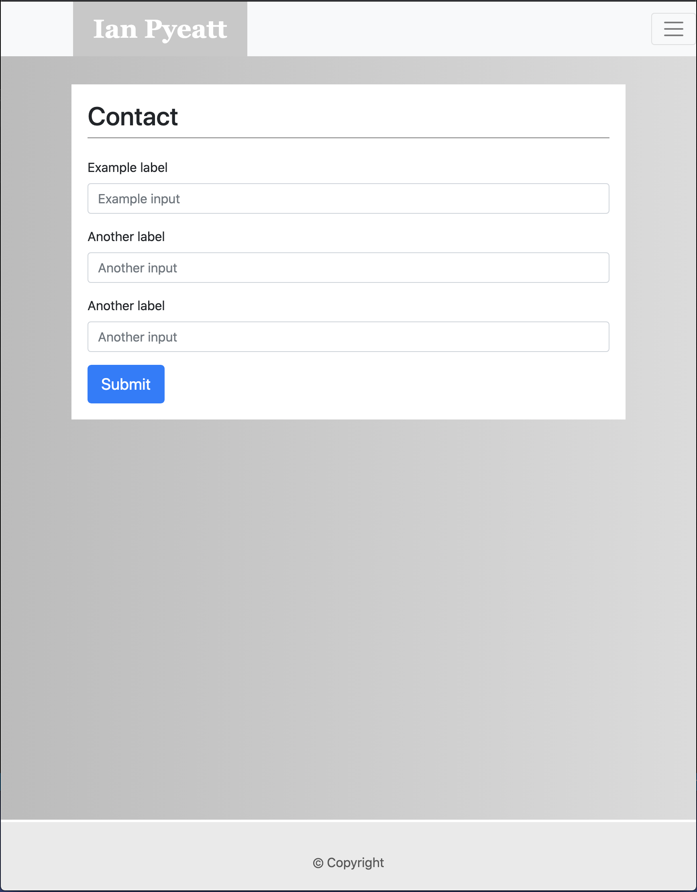
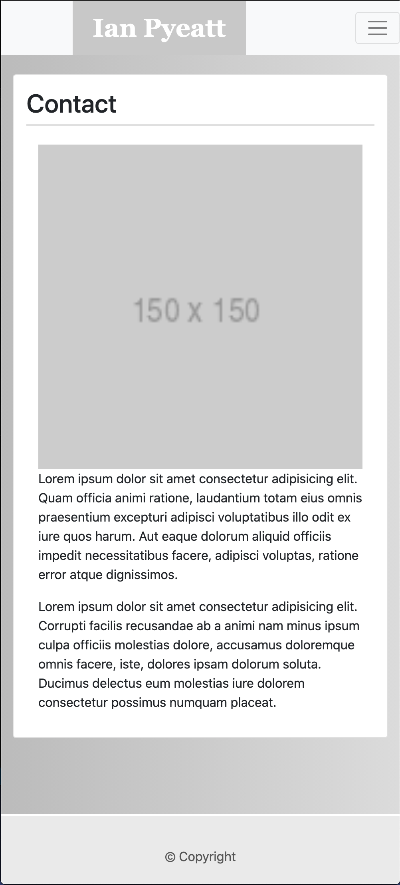
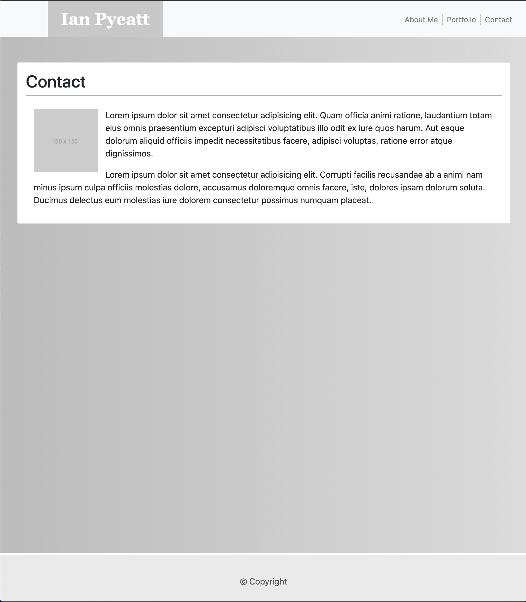

# BootstrapProject

## Description

This project is a responsive portfolio website, using bootstrap components.

## Updates
- Added Project 1
- Added Project 2

# LINK #

 https://pyeatti.github.io/BootstrapProject/

 ## NEED TO LEARN PROPER ETIQUITE FOR THE README.md DOCS ##

